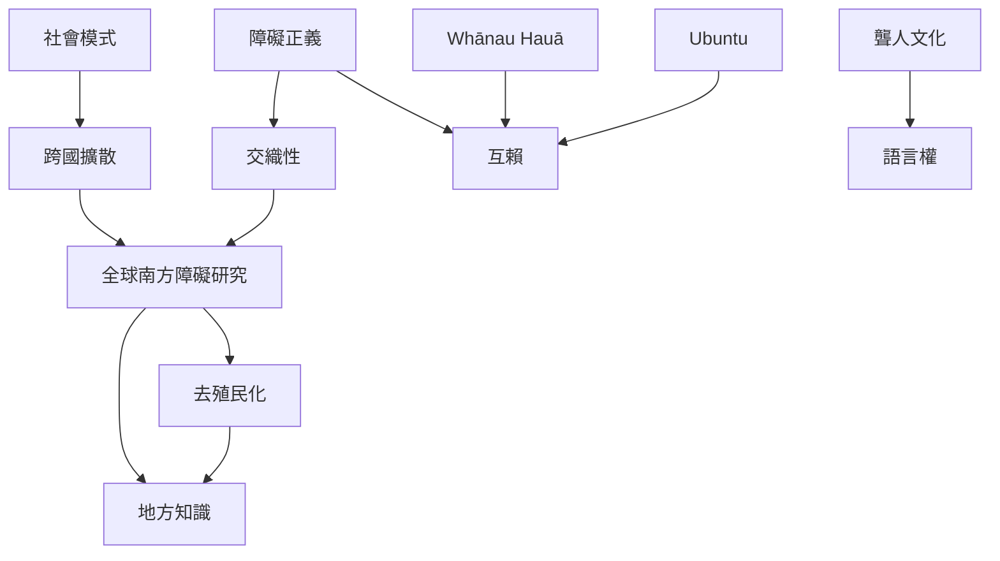

本圖將社會模式放入跨國歷史與批判理論中閱讀。英國社會模式是重要起點，但全球南方、原住民族、聾人社群與障礙正義運動提出不同的知識與政治問題。去殖民化與交織性提醒研究者注意知識權力、文化差異和多重壓迫。

```mermaid
graph TD
  A[社會模式] --> B[跨國擴散]
  B --> C[全球南方障礙研究]
  C --> D[去殖民化]
  C --> E[地方知識]
  F[障礙正義] --> G[交織性]
  F --> H[互賴]
  I[聾人文化] --> J[語言權]
  K[Whānau Hauā] --> H
  L[Ubuntu] --> H
  D --> E
  G --> C
```

延伸閱讀：[[全球南方障礙研究]]、[[去殖民化]]、[[地方知識]]、[[交織性]]、[[障礙正義]]、[[聾人文化]]、[[語言權]]、[[互賴]]。
