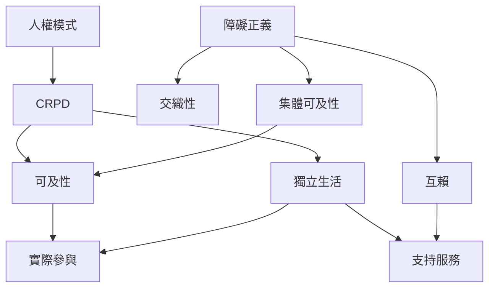

本圖呈現權利模式與障礙正義如何相互補充。CRPD 和人權模式提供國家義務與可問責框架；獨立生活重視選擇與控制；障礙正義則把互賴、交織性與集體可及性納入解放實踐。互賴不能取代個人自主，權利也不能只停留在法律文字。

```mermaid
graph TD
  A[人權模式] --> B[CRPD]
  B --> C[可及性]
  B --> D[獨立生活]
  D --> E[支持服務]
  F[障礙正義] --> G[交織性]
  F --> H[互賴]
  F --> I[集體可及性]
  H --> E
  I --> C
  C --> J[實際參與]
  D --> J
```

延伸閱讀：[[人權模式]]、[[CRPD]]、[[獨立生活]]、[[社區融合]]、[[支持服務]]、[[障礙正義]]、[[交織性]]、[[互賴]]、[[集體可及性]]。
