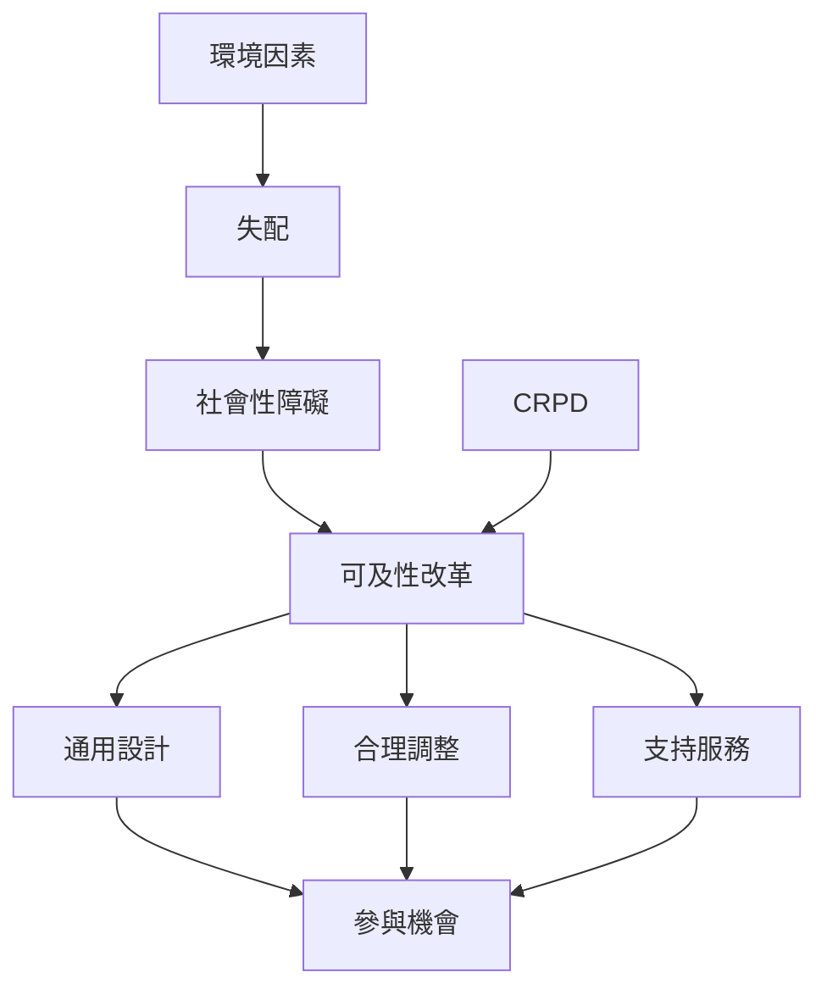

本圖將可及性視為社會參與的基礎條件。通用設計在前期降低普遍障礙，合理調整回應個別需求；支持服務則提供持續參與所需的資源。這些作法共同回應環境失配，但不應由此推論所有需求都能被同一套設計完全涵蓋。

```mermaid
graph TD
  A[環境因素] --> B[失配]
  B --> C[社會性障礙]
  C --> D[可及性改革]
  D --> E[通用設計]
  D --> F[合理調整]
  D --> G[支持服務]
  E --> H[參與機會]
  F --> H
  G --> H
  I[CRPD] --> D
```

延伸閱讀：[[可及性]]、[[通用設計]]、[[合理調整]]、[[支持服務]]、[[失配]]、[[環境因素]]、[[CRPD]]。
