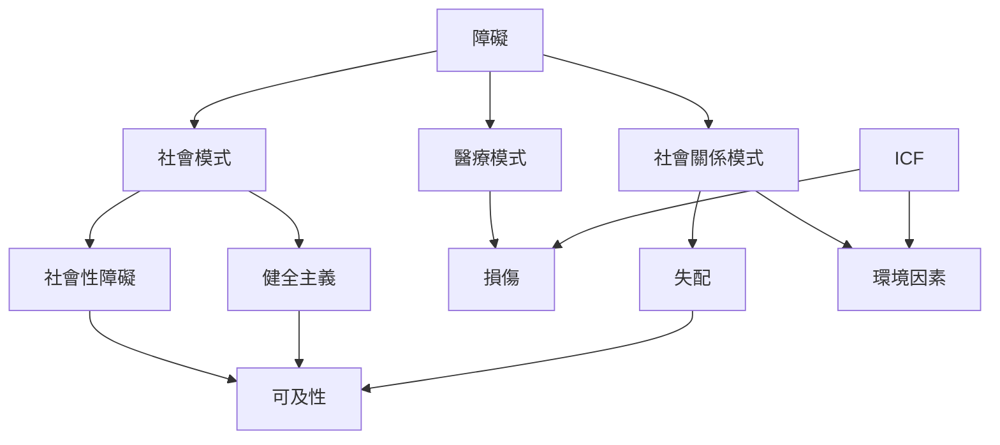

本圖整理不同障礙模型之間的理論關係。社會模式將焦點轉向社會性障礙；醫療模式提供身體與健康照護視角；社會關係模式與 ICF 則協助處理個人、環境和參與之間的複雜互動。這些模型不必被當成互斥陣營，應依分析問題選擇並互相檢驗。

```mermaid
graph TD
  A[障礙] --> B[社會模式]
  A --> C[醫療模式]
  A --> D[社會關係模式]
  B --> E[社會性障礙]
  B --> F[健全主義]
  C --> G[損傷]
  D --> H[失配]
  D --> I[環境因素]
  J[ICF] --> G
  J --> I
  E --> K[可及性]
  F --> K
  H --> K
```

延伸閱讀：[[社會模式]]、[[醫療模式]]、[[社會關係模式]]、[[損傷]]、[[障礙]]、[[失配]]、[[ICF]]、[[環境因素]]。
