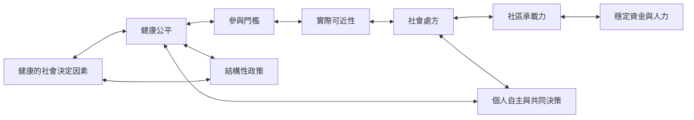

本圖提醒社會處方的服務設計本身也會分配資源和權力。公平需要檢查參與門檻、社區承載力與上游制度條件，而不能只問個人是否願意參加。

```mermaid
flowchart LR
 A[健康的社會決定因素] <--> B[健康公平]
 B <--> C[參與門檻]
 C <--> D[實際可近性]
 D <--> E[社會處方]
 E <--> F[社區承載力]
 F <--> G[穩定資金與人力]
 B <--> H[結構性政策]
 H <--> A
 E <--> I[個人自主與共同決策]
 I <--> B
```

* [[健康的社會決定因素]]
* [[健康公平]]
* [[社區承載力]]
* [[社會處方參與門檻本身就是健康公平議題]]
* [[社會處方應與結構政策並行而不是取代它們]]
* [[社會處方必須同時強化醫療系統與社區資產]]
