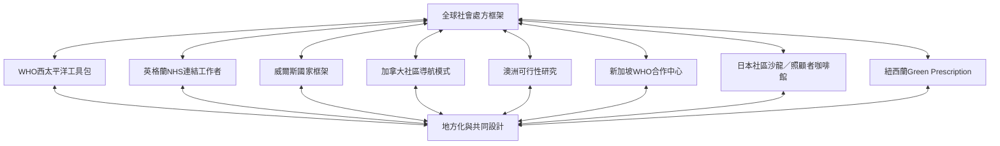

本圖比較不同地區如何將社區資源連結到健康照護。各地可使用不同名稱與既有制度，重要的是由地方需求、文化與組織能力共同塑造模式。

```mermaid
flowchart TD
 A[全球社會處方框架] <--> B[WHO西太平洋工具包]
 A <--> C[英格蘭NHS連結工作者]
 A <--> D[威爾斯國家框架]
 A <--> E[加拿大社區導航模式]
 A <--> F[澳洲可行性研究]
 A <--> G[新加坡WHO合作中心]
 A <--> H[日本社區沙龍／照顧者咖啡館]
 A <--> I[紐西蘭Green Prescription]
 B <--> J[地方化與共同設計]
 C <--> J
 D <--> J
 E <--> J
 F <--> J
 G <--> J
 H <--> J
 I <--> J
```

* [[十二個高收入國家的比較顯示社會處方會隨制度脈絡改變]]
* [[西太平洋地區的回顧顯示社會處方常以不同名稱存在]]
* [[社會處方模式必須依地方制度與文化調整]]
* [[亞洲社會處方應辨認既有社區實踐而非只移植英國術語]]
