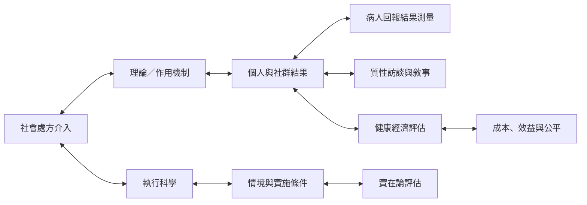

本圖整理社會處方的複雜介入特性：研究需同時辨識結果、作用機制與情境，並選擇相符的評估方法。個人回報、社區影響和經濟成本應互相補充。

```mermaid
flowchart LR
 A[社會處方介入] <--> B[理論／作用機制]
 A <--> C[執行科學]
 C <--> D[情境與實施條件]
 B <--> E[個人與社群結果]
 E <--> F[病人回報結果測量]
 E <--> G[質性訪談與敘事]
 D <--> H[實在論評估]
 E <--> I[健康經濟評估]
 I <--> J[成本、效益與公平]
```

* [[執行科學]]
* [[實在論評估]]
* [[病人回報結果測量]]
* [[社會處方評估必須同時看個人社群與系統層次]]
* [[研究設計必須把介入效果與實施條件分開辨認]]
* [[社會處方的轉介量不能代替實際參與與生活改變]]
