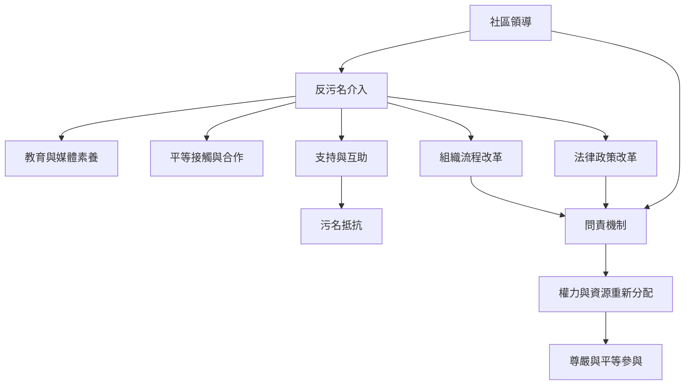

反污名不是單一宣導活動，而是個人、人際、社區、組織與制度層次的組合。受影響社群需要從被研究或被服務者轉為知識與決策的共同作者。

```mermaid
flowchart TD
 A[反污名介入]
 A --> B[教育與媒體素養]
 A --> C[平等接觸與合作]
 A --> D[支持與互助]
 A --> E[組織流程改革]
 A --> F[法律政策改革]
 D --> G[污名抵抗]
 E --> H[問責機制]
 F --> H
 I[社區領導] --> A
 I --> H
 H --> J[權力與資源重新分配]
 J --> K[尊嚴與平等參與]
```

概念連結：[[反污名介入]]、[[接觸假說]]、[[社區領導]]、[[污名抵抗]]、[[反污名介入需要從個人態度延伸到制度問責]]、[[反污名的成功指標應包含權力與資源重新分配]]。

本圖屬於[[Social_stigma]]的閱讀與整理架構。
