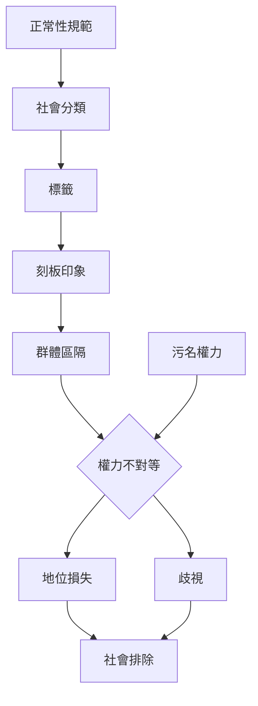

本圖將污名視為由分類到資源分配的關係鏈。標籤和刻板印象形成群體邊界；在權力不對等下，邊界可轉為地位損失、歧視與社會排除。

```mermaid
flowchart TD
 A[社會分類] --> B[標籤]
 B --> C[刻板印象]
 C --> D[群體區隔]
 D --> E{權力不對等}
 E --> F[地位損失]
 E --> G[歧視]
 F --> H[社會排除]
 G --> H
 I[污名權力] --> E
 J[正常性規範] --> A
```

概念連結：[[社會污名]]、[[標籤]]、[[刻板印象]]、[[群體區隔]]、[[污名權力]]、[[結構性污名]]、[[歧視]]、[[他者化]]、[[正常性]]。

本圖屬於[[Social_stigma]]的閱讀與整理架構。
