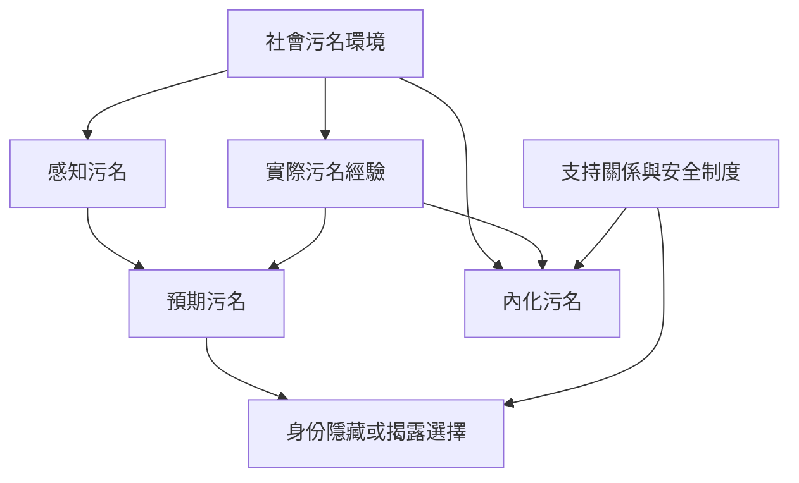

本圖區分外在事件、對社會態度的理解、對未來的預期，以及把負面評價轉向自我的過程。身份隱藏與揭露是情境策略，不是污名程度的直接指標。

```mermaid
flowchart TD
 A[社會污名環境] --> B[感知污名]
 A --> C[實際污名經驗]
 B --> D[預期污名]
 C --> D
 D --> E[身份隱藏或揭露選擇]
 A --> F[內化污名]
 C --> F
 G[支持關係與安全制度] --> E
 G --> F
```

概念連結：[[感知污名]]、[[實際污名經驗]]、[[預期污名]]、[[內化污名]]、[[身份隱藏]]、[[關係污名]]、[[交織性]]。

本圖屬於[[Social_stigma]]的閱讀與整理架構。
