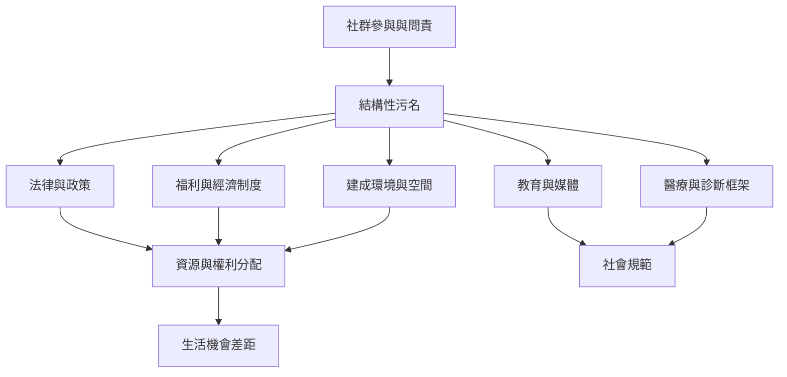

結構性污名可經由法律、福利、教育、媒體、醫療、經濟與空間安排發生。圖中把制度領域視為污名的上游條件，並以問責和共同治理作為改革入口。

```mermaid
flowchart TD
 A[結構性污名]
 A --> B[法律與政策]
 A --> C[福利與經濟制度]
 A --> D[教育與媒體]
 A --> E[醫療與診斷框架]
 A --> F[建成環境與空間]
 B --> G[資源與權利分配]
 C --> G
 D --> H[社會規範]
 E --> H
 F --> G
 G --> I[生活機會差距]
 J[社群參與與問責] --> A
```

概念連結：[[結構性污名]]、[[結構性歧視]]、[[污名權力]]、[[社會排除]]、[[身心障礙歧視]]、[[反污名介入]]。

本圖屬於[[Social_stigma]]的閱讀與整理架構。
