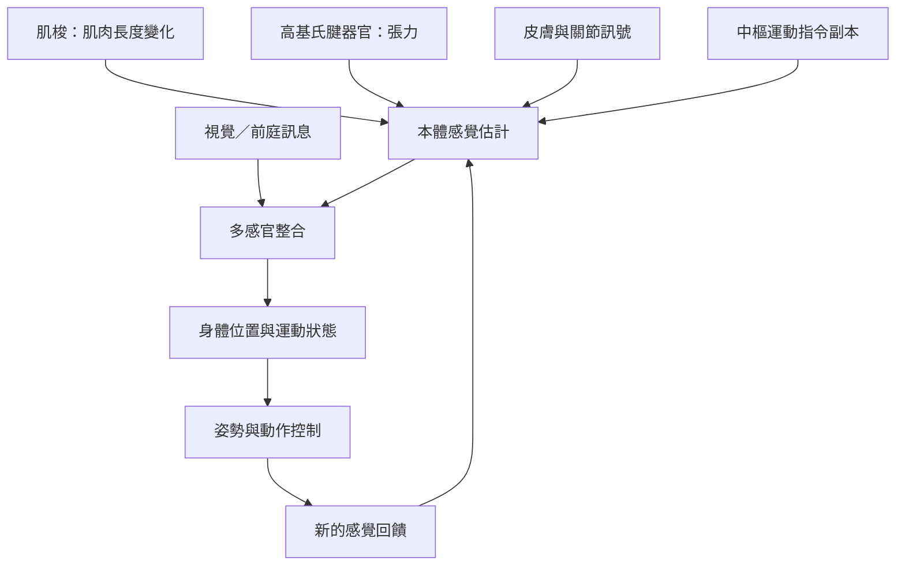

本體感覺不是單一受器回報，而是肌肉、肌腱、皮膚、關節及中樞運動訊號共同形成的身體機械狀態估計。它與視覺、前庭和觸地資訊整合，支援日常動作與技能學習。

```mermaid
flowchart TD
  A[肌梭：肌肉長度變化] --> D[本體感覺估計]
  B[高基氏腱器官：張力] --> D
  C[皮膚與關節訊號] --> D
  E[中樞運動指令副本] --> D
  F[視覺／前庭訊息] --> G[多感官整合]
  D --> G
  G --> H[身體位置與運動狀態]
  H --> I[姿勢與動作控制]
  I --> J[新的感覺回饋]
  J --> D
```

閱讀[[本體感覺讓身體在沒有視覺監控時仍能協調動作]]與[[動作技能依靠感覺回饋與運動預測持續校正]]，再連到[[走路把皮膚觸覺與本體感覺連成持續回饋迴路]]。詞條包括[[本體感覺]]、[[肌梭]]、[[高基氏腱器官]]與[[動覺]]。
