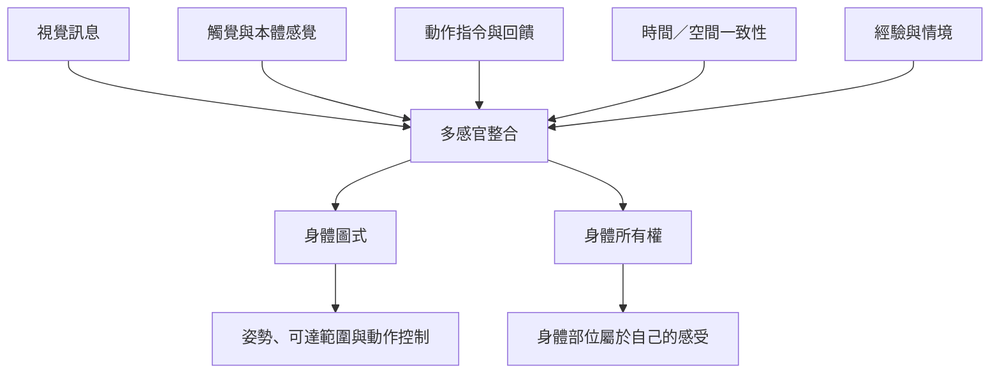

身體圖式偏向支援行動的身體表徵，身體所有權則偏向「這是我的身體」的主觀歸屬感。兩者都依賴多感官整合，也會隨感覺回饋更新，但不是同一個概念。

```mermaid
flowchart TD
  A[視覺訊息] --> C[多感官整合]
  B[觸覺與本體感覺] --> C
  D[動作指令與回饋] --> C
  C --> E[身體圖式]
  C --> F[身體所有權]
  E --> G[姿勢、可達範圍與動作控制]
  F --> H[身體部位屬於自己的感受]
  I[時間／空間一致性] --> C
  J[經驗與情境] --> C
```

閱讀[[身體圖式是持續更新的行動身體模型]]與[[身體所有權來自視覺觸覺與本體訊息的整合]]，再追蹤[[身體所有權會隨多感官一致性而更新]]。詞條：[[身體圖式]]、[[本體感覺]]、[[初級體感覺皮質]]。
