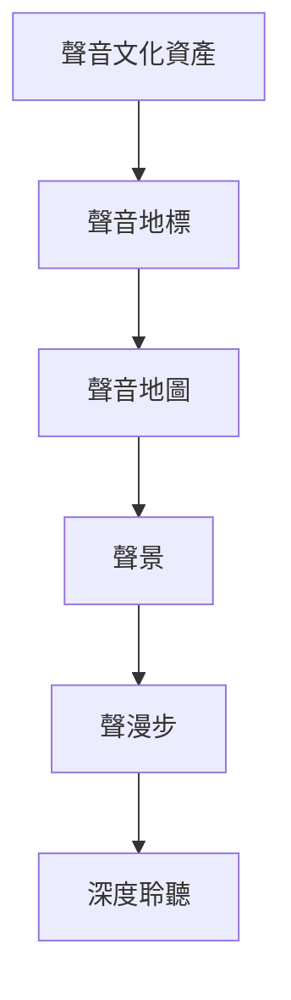

聲音不只來自自然與交通，也承載地方生活、文化認同與集體記憶。聲音地標、地方錄音、文學敘事與口述史能構成地方的聽覺文化地圖。

本圖連結：[[聲音文化資產]]、[[聲音地標]]、[[聲音地圖]]、[[聲景]]、[[聲漫步]]、[[深度聆聽]]

```mermaid
flowchart TD
  n1["聲音文化資產"]
  n2["聲音地標"]
  n3["聲音地圖"]
  n4["聲景"]
  n5["聲漫步"]
  n6["深度聆聽"]
  n1 --> n2
  n2 --> n3
  n3 --> n4
  n4 --> n5
  n5 --> n6
```
