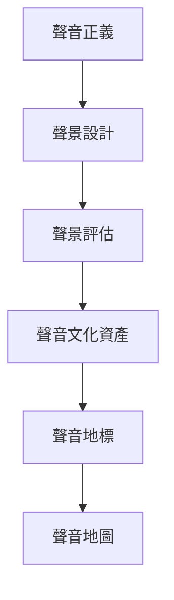

聲景既是公共健康風險，也是可支持福祉與社會生活的資源。治理需同時減少有害暴露、保存地方聲音、提高安靜空間可達性，並讓居民參與決策。

本圖連結：[[聲音正義]]、[[聲景設計]]、[[聲景評估]]、[[聲音文化資產]]、[[聲音地標]]、[[聲音地圖]]

```mermaid
flowchart TD
  n1["聲音正義"]
  n2["聲景設計"]
  n3["聲景評估"]
  n4["聲音文化資產"]
  n5["聲音地標"]
  n6["聲音地圖"]
  n1 --> n2
  n2 --> n3
  n3 --> n4
  n4 --> n5
  n5 --> n6
```
