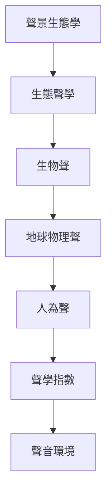

生態聲景把聲音作為理解生物群落、地球物理過程與人類活動的資料。研究須掌握時間尺度、取樣設計與聲學指數的侷限，並將錄音與生態調查交叉驗證。

本圖連結：[[聲景生態學]]、[[生態聲學]]、[[生物聲]]、[[地球物理聲]]、[[人為聲]]、[[聲學指數]]、[[聲音環境]]

```mermaid
flowchart TD
  n1["聲景生態學"]
  n2["生態聲學"]
  n3["生物聲"]
  n4["地球物理聲"]
  n5["人為聲"]
  n6["聲學指數"]
  n7["聲音環境"]
  n1 --> n2
  n2 --> n3
  n3 --> n4
  n4 --> n5
  n5 --> n6
  n6 --> n7
```
