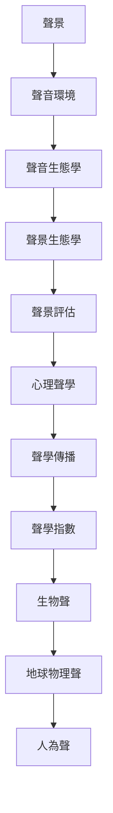

聲景可理解為人在情境中感知的聲音環境。本概念地圖從定義、組成、感知者與方法四條線索建立閱讀入口，強調聲音環境、聲源分類與聆聽者經驗不能混為一談。

本圖連結：[[聲景]]、[[聲音環境]]、[[聲音生態學]]、[[聲景生態學]]、[[聲景評估]]、[[心理聲學]]、[[聲學傳播]]、[[聲學指數]]、[[生物聲]]、[[地球物理聲]]、[[人為聲]]

```mermaid
flowchart TD
  n1["聲景"]
  n2["聲音環境"]
  n3["聲音生態學"]
  n4["聲景生態學"]
  n5["聲景評估"]
  n6["心理聲學"]
  n7["聲學傳播"]
  n8["聲學指數"]
  n9["生物聲"]
  n10["地球物理聲"]
  n11["人為聲"]
  n1 --> n2
  n2 --> n3
  n3 --> n4
  n4 --> n5
  n5 --> n6
  n6 --> n7
  n7 --> n8
  n8 --> n9
  n9 --> n10
  n10 --> n11
```
