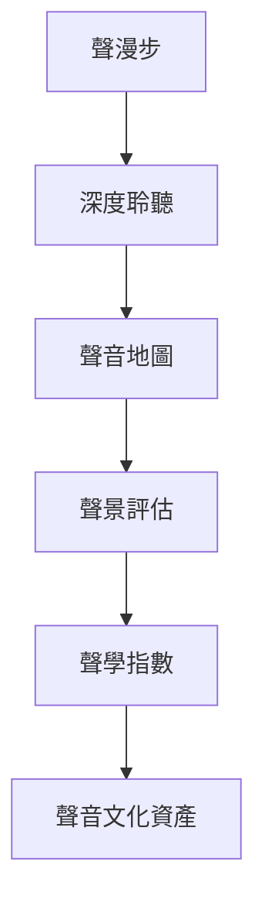

聲景研究需要在現地聆聽、資料蒐集、聲學分析與情境理解之間往返。聲漫步、訪談、長期錄音與聲音地圖各自捕捉不同尺度，適合互補而非互相取代。

本圖連結：[[聲漫步]]、[[深度聆聽]]、[[聲音地圖]]、[[聲景評估]]、[[聲學指數]]、[[聲音文化資產]]

```mermaid
flowchart TD
  n1["聲漫步"]
  n2["深度聆聽"]
  n3["聲音地圖"]
  n4["聲景評估"]
  n5["聲學指數"]
  n6["聲音文化資產"]
  n1 --> n2
  n2 --> n3
  n3 --> n4
  n4 --> n5
  n5 --> n6
```
