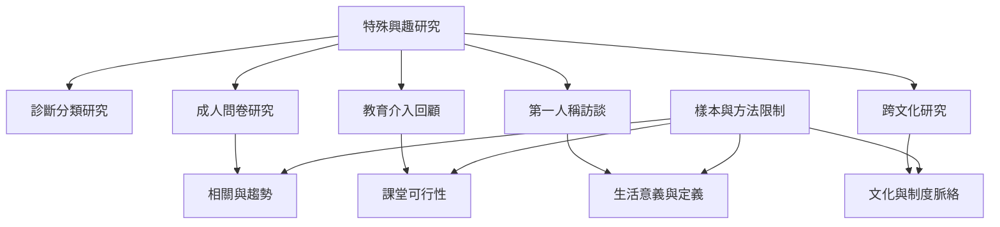

特殊興趣研究包含臨床診斷、成人問卷、兒童教育回顧、成人訪談與跨文化框架。不同方法能回答不同問題，樣本地理分布與溝通方式也會影響研究結論的可推廣範圍。

```mermaid
graph TD
  A[特殊興趣研究] --> B[診斷分類研究]
  A --> C[成人問卷研究]
  A --> D[教育介入回顧]
  A --> E[第一人稱訪談]
  A --> F[跨文化研究]
  C --> G[相關與趨勢]
  D --> H[課堂可行性]
  E --> I[生活意義與定義]
  F --> J[文化與制度脈絡]
  K[樣本與方法限制] --> G
  K --> H
  K --> I
  K --> J
```

## 概念連結
* [[全球研究必須避免把西方樣本當作普遍經驗]]、[[自閉症者的第一人稱敘事應是特殊興趣知識的核心來源]]、[[研究特殊興趣時必須納入不同溝通方式的參與者]]。
