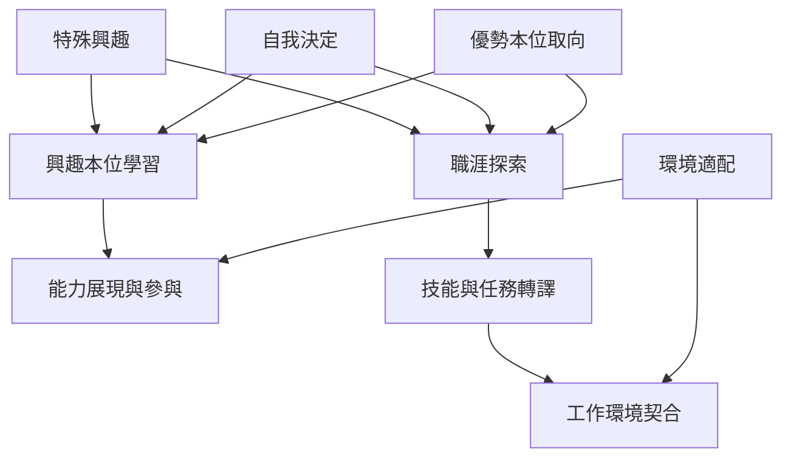

興趣可以成為課程與職涯探索的入口，但支持的品質取決於當事人的選擇權、環境適配與是否保留興趣的非功利價值。教育與職涯都應以共同設計、實際需求與福祉為中心。

```mermaid
graph TD
  A[特殊興趣] --> B[興趣本位學習]
  B --> C[能力展現與參與]
  A --> D[職涯探索]
  D --> E[技能與任務轉譯]
  E --> F[工作環境契合]
  G[自我決定] --> B
  G --> D
  H[環境適配] --> C
  H --> F
  I[優勢本位取向] --> B
  I --> D
```

## 概念連結
* [[特殊興趣]]、[[興趣本位學習]]、[[優勢本位取向]]、[[自我決定]]、[[環境適配]]、[[高度投入興趣]]。
