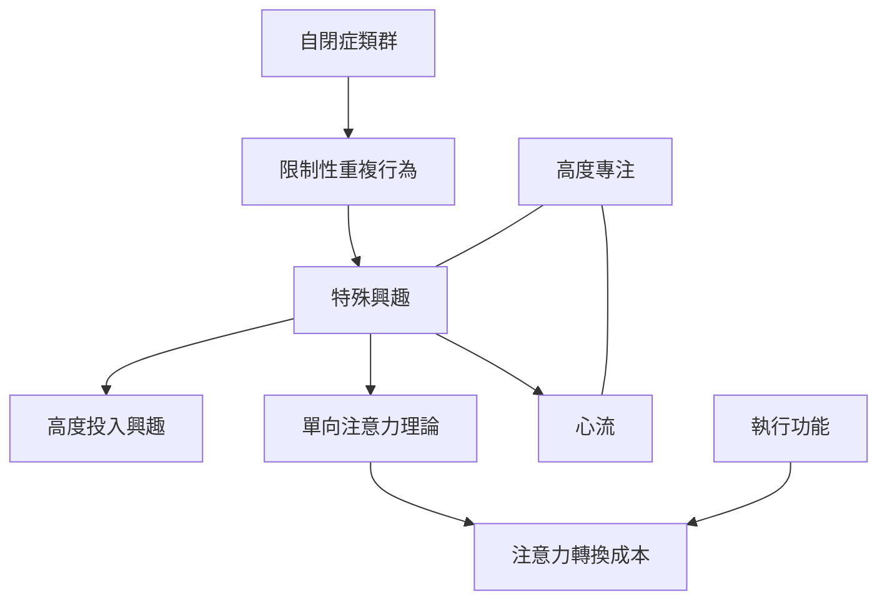

特殊興趣可以從注意力、沉浸、轉換與重複模式理解；這些概念彼此相關，但不是同義詞。單向注意力提供理論解釋，心流描述投入狀態，執行功能與注意力轉換則協助分析任務切換的要求。

```mermaid
graph TD
  A[自閉症類群] --> B[限制性重複行為]
  B --> C[特殊興趣]
  C --> D[高度投入興趣]
  C --> E[單向注意力理論]
  E --> F[注意力轉換成本]
  C --> G[心流]
  H[執行功能] --> F
  I[高度專注] --- G
  I --- C
```

## 概念連結
* [[特殊興趣]]、[[單向注意力]]、[[高度投入興趣]]、[[心流]]、[[高度專注]]、[[注意力轉換]]、[[執行功能]]、[[限制性重複行為]]。
