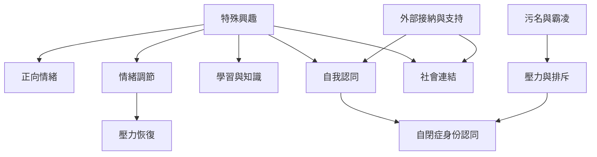

特殊興趣可能成為正向情緒、知識累積、自我價值、身份與社會連結的資源，也可能因投入壓力、污名與支持不足產生負面後果。理解福祉時，應同時看內在功能與外部環境。

```mermaid
graph TD
  A[特殊興趣] --> B[正向情緒]
  A --> C[情緒調節]
  A --> D[學習與知識]
  A --> E[自我認同]
  A --> F[社會連結]
  C --> G[壓力恢復]
  E --> H[自閉症身份認同]
  I[污名與霸凌] --> J[壓力與排斥]
  K[外部接納與支持] --> E
  K --> F
  J --> H
```

## 概念連結
* [[特殊興趣]]、[[情緒調節]]、[[自閉症身份認同]]、[[污名]]、[[神經多樣性]]、[[雙重同理問題]]、[[自閉症耗竭]]。
