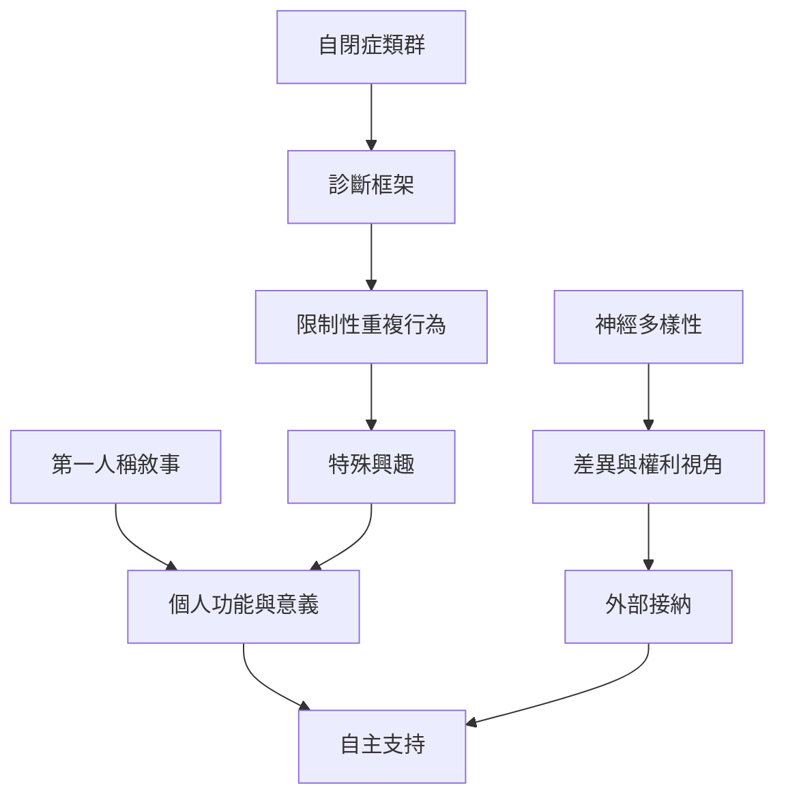

臨床分類將高度固著興趣納入限制性、重複性行為領域；神經多樣性與當事人敘事則要求理解興趣對個人生活的意義。兩者回答的問題不同：診斷分類協助辨識支持需求，生活敘事則揭示個人價值、權利與環境影響。

```mermaid
graph TD
  A[自閉症類群] --> B[診斷框架]
  B --> C[限制性重複行為]
  C --> D[特殊興趣]
  E[神經多樣性] --> F[差異與權利視角]
  G[第一人稱敘事] --> H[個人功能與意義]
  D --> H
  F --> I[外部接納]
  H --> J[自主支持]
  I --> J
```

## 概念連結
* [[自閉症類群障礙]]、[[限制性重複行為]]、[[特殊興趣]]、[[神經多樣性]]、[[自閉症身份認同]]、[[自我決定]]、[[污名]]。
