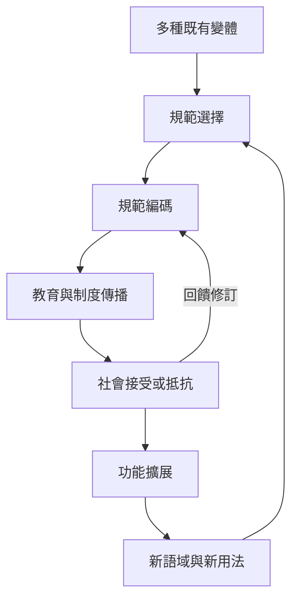

標準化同時處理社會選擇與接受，以及語言形式的編碼與功能擴展。這張圖把四個面向視為互相影響的環節，而不是僵硬的線性流程。

```mermaid
flowchart TD
    A[多種既有變體] --> B[規範選擇]
    B --> C[規範編碼]
    C --> D[教育與制度傳播]
    D --> E[社會接受或抵抗]
    E --> F[功能擴展]
    F --> G[新語域與新用法]
    G --> B
    E -->|回饋修訂| C
```

Haugen 的四分模型見[[標準化是社會選擇與語言形式共同作用的歷史過程]]；實際使用與規定性規範的落差見[[語言標準的形式規則與實際使用規範必須分開描述]]。概念定義見[[規範選擇]]、[[規範編碼]]、[[功能擴展]]與[[社會接受]]。
