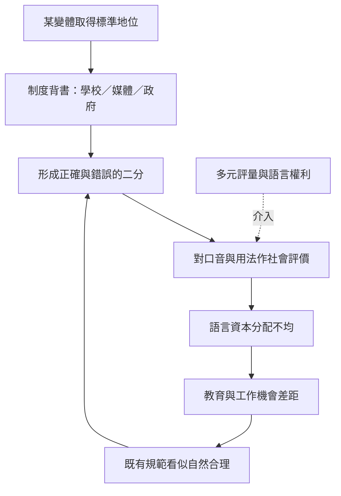

標準語意識形態經由制度擴散，再被用來評價說話者。這張圖呈現偏見如何由抽象規範落到教育、職場與公共生活中的機會差距。

```mermaid
flowchart TD
    A[某變體取得標準地位] --> B[制度背書：學校／媒體／政府]
    B --> C[形成正確與錯誤的二分]
    C --> D[對口音與用法作社會評價]
    D --> E[語言資本分配不均]
    E --> F[教育與工作機會差距]
    F --> G[既有規範看似自然合理]
    G --> C
    H[多元評量與語言權利] -.->|介入| D
```

參見[[標準語意識形態把差異誤讀成能力缺陷]]、[[標準語的社會資本效果會把語言能力轉成機會差距]]與[[語言標準應被視為可修訂的公共協議而非永恆戒律]]。相關文獻：[[口音歧視能透過教育媒體職場與司法制度持續複製]]。
