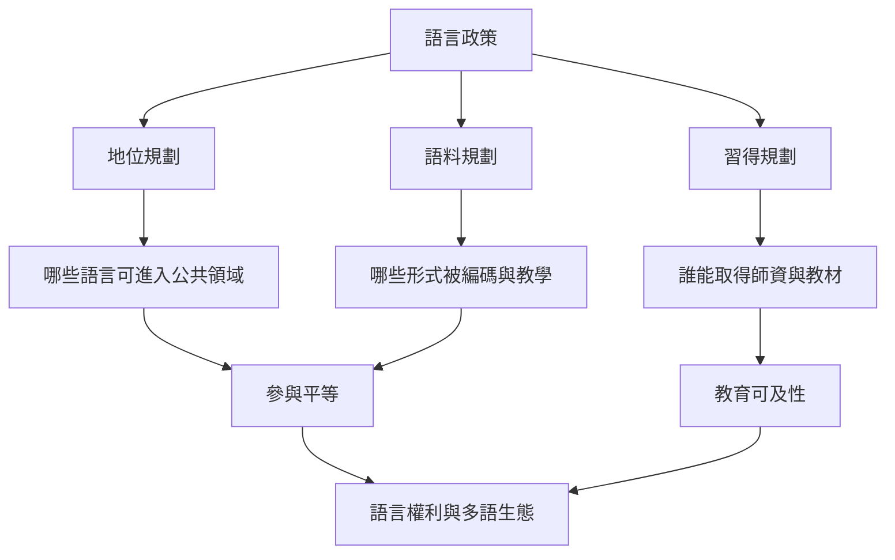

共同語政策、家庭語言、地方語言復振與多語教育不是互斥選項。政策設計需要同時處理語言地位、形式標準、習得資源及公共服務。

```mermaid
flowchart TD
    A[語言政策] --> B[地位規劃]
    A --> C[語料規劃]
    A --> D[習得規劃]
    B --> E[哪些語言可進入公共領域]
    C --> F[哪些形式被編碼與教學]
    D --> G[誰能取得師資與教材]
    E --> H[參與平等]
    F --> H
    G --> I[教育可及性]
    H --> J[語言權利與多語生態]
    I --> J
```

核心論點見[[國家共同語的普及與語言多樣性維護需要分開評估]]、[[教育可及性不能以消除家庭語言為代價]]與[[標準語政策應以可理解性與參與平等作為雙重目標]]。參照[[語言規劃]]、[[地位規劃]]、[[語料規劃]]、[[習得規劃]]及[[多語教育]]。
