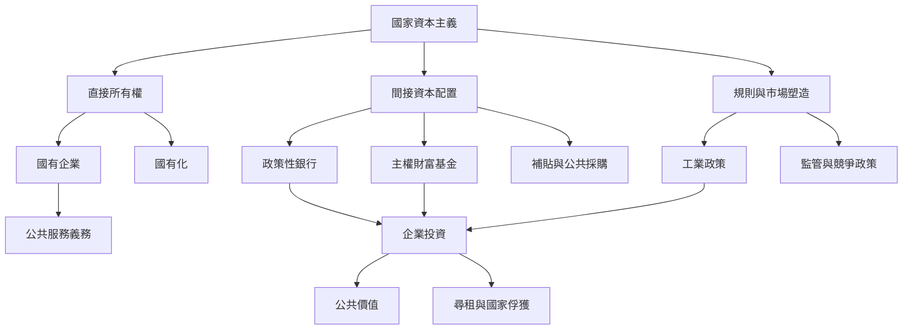

國家可以透過所有權、金融、監管與市場塑造影響資本累積。這張地圖把工具分成直接與間接兩組，並連結公共任務與治理風險。

```mermaid
graph TD
  A[國家資本主義] --> B[直接所有權]
  A --> C[間接資本配置]
  A --> D[規則與市場塑造]
  B --> E[國有企業]
  B --> F[國有化]
  C --> G[政策性銀行]
  C --> H[主權財富基金]
  C --> I[補貼與公共採購]
  D --> J[工業政策]
  D --> K[監管與競爭政策]
  E --> L[公共服務義務]
  G --> M[企業投資]
  H --> M
  J --> M
  M --> N[公共價值]
  M --> O[尋租與國家俘獲]
```

這些工具與[[國家資本主義可以透過金融工具而非直接持股運作]]、[[國有企業治理的核心難題是所有者政策與監管職能容易混淆]]互相補充；概念定義可參考[[國有企業]]、[[政策性銀行]]、[[主權財富基金]]、[[工業政策]]、[[市場失靈]]與[[公共服務義務]]。
