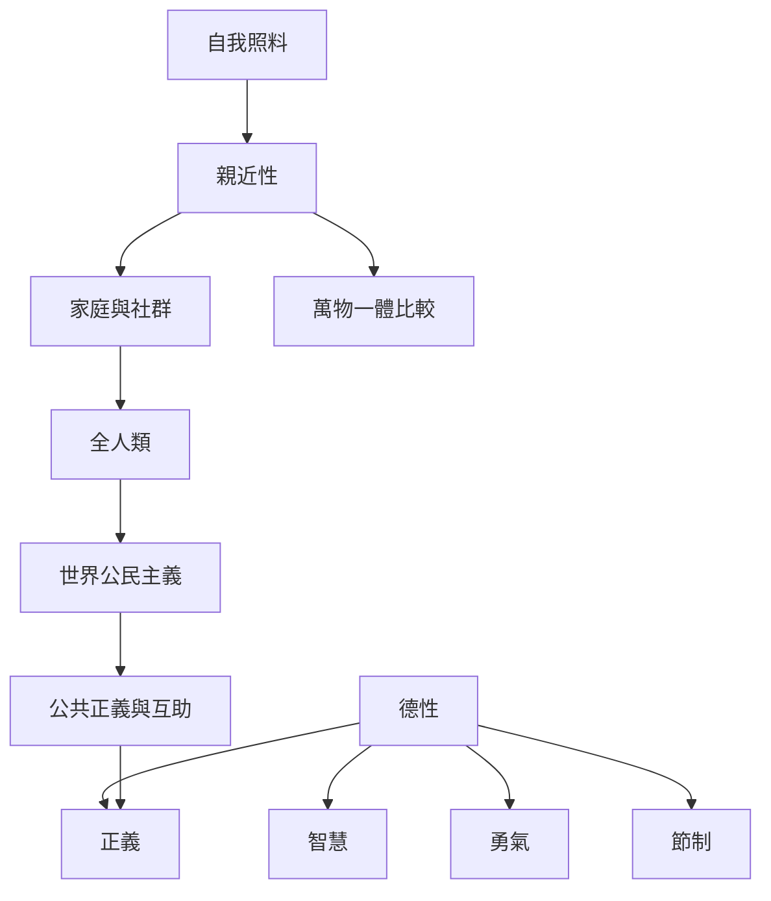

斯多葛倫理以德性為核心，但並未止於個人自我控制。親近性理論解釋關懷如何擴張，世界公民觀則將共同責任延伸到陌生人與整體自然。

```mermaid
flowchart TD
  A[自我照料] --> B[親近性]
  B --> C[家庭與社群]
  C --> D[全人類]
  D --> E[世界公民主義]
  E --> F[公共正義與互助]
  I[德性] --> J[智慧]
  I --> K[勇氣]
  I --> L[正義]
  I --> M[節制]
  F --> L
  B --> N[萬物一體比較]
```

對照 [[親近性理論說明道德關懷如何由自身逐步擴展]]、[[斯多葛世界公民觀把陌生人納入共同責任]]、[[斯多葛的四種德性把抽象善落實為可辨認的行動品質]]，並以 [[萬物一體與親近性理論都試圖說明關懷如何從自身擴展]] 進行比較。
