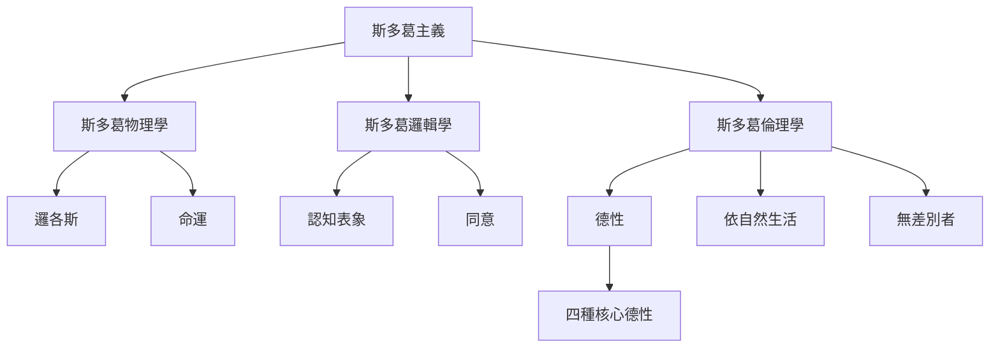

斯多葛哲學不是三門互不相干的學科，而是把世界如何運作、我們如何知道，以及應如何生活連成一個整體。閱讀路徑可由倫理問題進入，再回頭理解其邏輯與物理學基礎。

```mermaid
flowchart TD
  A[斯多葛主義] --> B[斯多葛物理學]
  A --> C[斯多葛邏輯學]
  A --> D[斯多葛倫理學]
  B --> E[邏各斯]
  B --> F[命運]
  C --> G[認知表象]
  C --> H[同意]
  D --> I[德性]
  D --> J[依自然生活]
  I --> K[四種核心德性]
  D --> L[無差別者]
```

本圖的重點是：[[斯多葛哲學不是冷漠術，而是理解自然後實踐德性的整體系統]]；三分結構由 [[斯多葛主義]]、[[斯多葛物理學]]、[[斯多葛邏輯學]] 與 [[斯多葛倫理學]] 共同構成。
