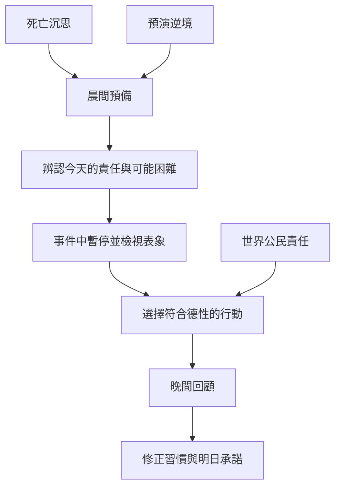

斯多葛實踐可被理解為一組日常反覆進行的判斷、情緒檢視、時間反省與公共行動練習，而不是一次讀懂後就完成的知識。

```mermaid
flowchart TD
  A[晨間預備] --> B[辨認今天的責任與可能困難]
  B --> C[事件中暫停並檢視表象]
  C --> D[選擇符合德性的行動]
  D --> E[晚間回顧]
  E --> F[修正習慣與明日承諾]
  G[死亡沉思] --> A
  H[預演逆境] --> A
  I[世界公民責任] --> D
```

核心工具是 [[可支配性區分]]、[[精神操練]]、[[死亡沉思]] 與 [[預演逆境]]。可實作 [[把每日反省設計成一個不責備自己的微型回顧儀式]]、[[把可支配性區分改寫成三欄表以防止偽控制感]]，同時記得 [[哲學練習可以成為因應資源，但不能被當作醫療替代品]]。
