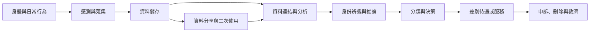

這張地圖聚焦技術流程：身體或行為被感測後，資料進入儲存、連結、推論與決策，最後影響個人或群體。任何一個階段都可能出現目的擴張、偏差或權責不清。

```mermaid
flowchart LR
  A[身體與日常行為] --> B[感測與蒐集]
  B --> C[資料儲存]
  C --> D[資料連結與分析]
  D --> E[身份辨識與推論]
  E --> F[分類與決策]
  F --> G[差別待遇或服務]
  C --> H[資料分享與二次使用]
  H --> D
  G --> I[申訴、刪除與救濟]
```

* [[數位監控將離散行為轉化為可持續連結的資料軌跡]]
* [[生物辨識將身體特徵變成難以更換的身份憑證]]
* [[監控分析應追問資料生命週期而非只問設備是否拍攝]]
* [[功能擴張 Function creep]]
