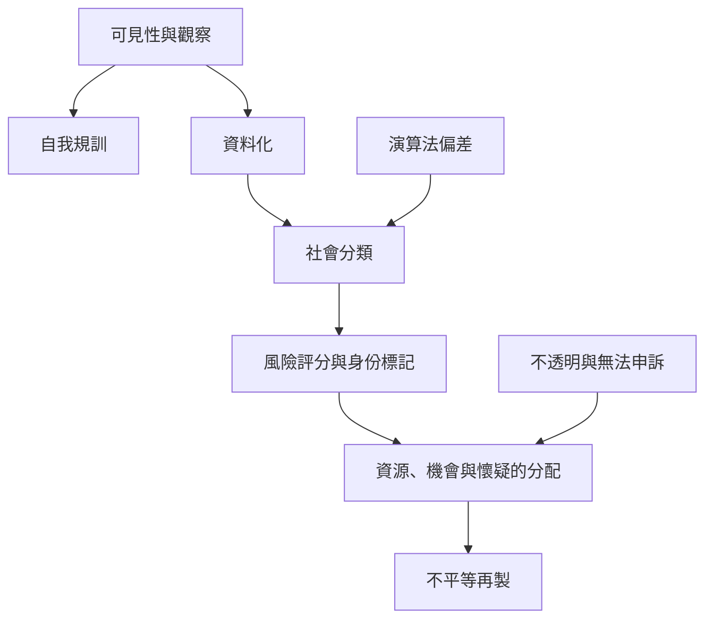

監控的治理效果常透過分類發生。全景敞視解釋可見性如何塑造行為，社會分類解釋資料如何分配懷疑與機會，人工智慧則可能加速分類並讓既有偏差更難被看見。

```mermaid
flowchart TD
  A[可見性與觀察] --> B[自我規訓]
  A --> C[資料化]
  C --> D[社會分類]
  D --> E[風險評分與身份標記]
  E --> F[資源、機會與懷疑的分配]
  G[演算法偏差] --> D
  H[不透明與無法申訴] --> F
  F --> I[不平等再製]
```

* [[可被觀察的可能性足以促使人們預先自我規訓]]
* [[社會分類把資料轉成差別待遇的制度入口]]
* [[人工智慧監控偏差會透過制度部署放大而非單由模型決定]]
* [[監控會以風險管理名義重新分配機會與懷疑]]
