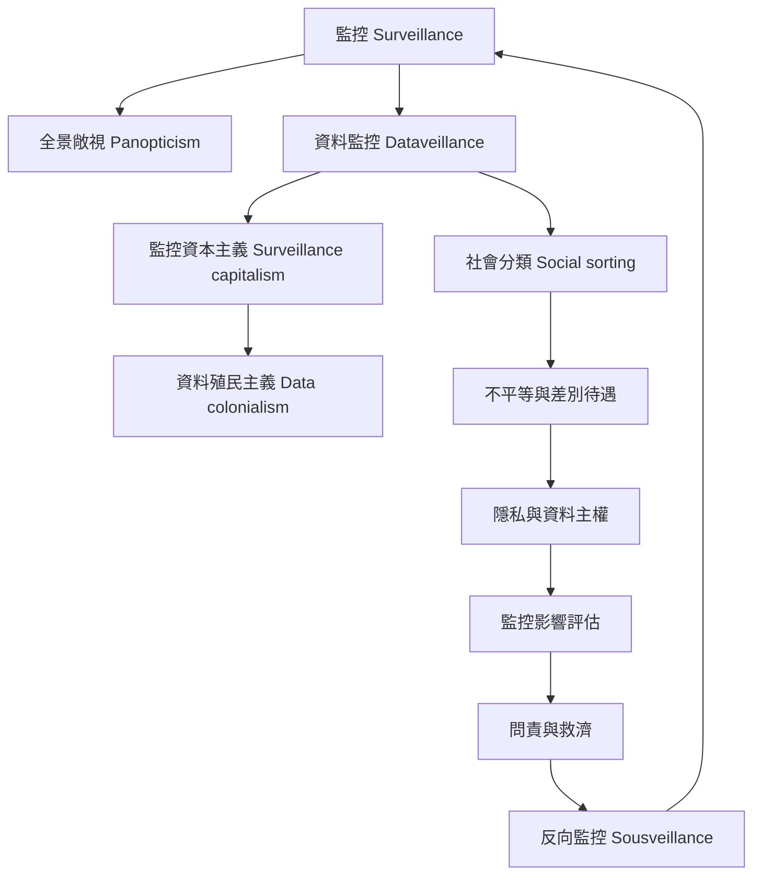

此地圖把監控研究串成一條分析路徑：從觀察與資料化開始，經由分類與決策產生權力效果，再以權利框架、社群治理與反向監控回應。閱讀時可在理論、案例與治理工具之間往返。

```mermaid
flowchart TD
  A[監控 Surveillance] --> B[全景敞視 Panopticism]
  A --> C[資料監控 Dataveillance]
  C --> D[社會分類 Social sorting]
  C --> E[監控資本主義 Surveillance capitalism]
  E --> F[資料殖民主義 Data colonialism]
  D --> G[不平等與差別待遇]
  G --> H[隱私與資料主權]
  H --> I[監控影響評估]
  I --> J[問責與救濟]
  J --> K[反向監控 Sousveillance]
  K --> A
```

* [[監控是一種分配可見性分類與行動自由的權力關係]]
* [[監控權力不只取決於誰能看見也取決於誰能分類]]
* [[監控治理必須以權利救濟而非技術效率為底線]]
* [[反向監控能改善可見性不對稱但不能自行消除權力差]]
