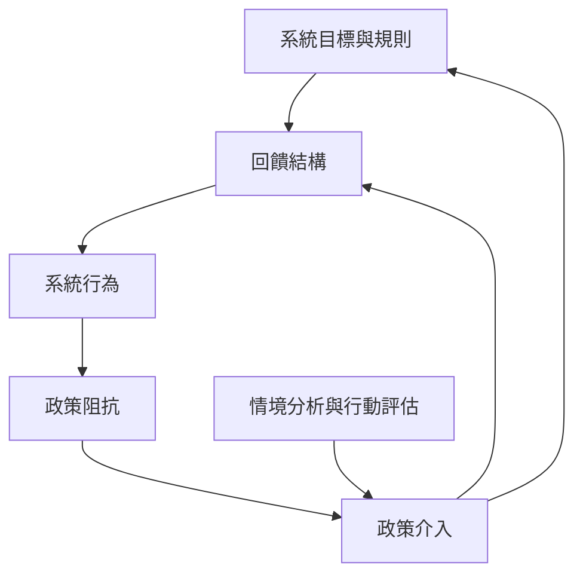

此地圖把介入策略連結到系統目標、規則、資訊流、回饋結構與政策阻抗。槓桿點提供思考方向，但每項介入都需要機制假說、受益者與成本分配分析，並透過情境和行動追蹤驗證。

```mermaid
flowchart TD
  A[系統目標與規則] --> B[回饋結構]
  B --> C[系統行為]
  D[政策介入] --> A
  D --> B
  C --> E[政策阻抗]
  E --> D
  F[情境分析與行動評估] --> D
```

概念節點：[[槓桿點]]、[[政策阻抗]]、[[系統原型]]、[[系統目標]]、[[回饋]]、[[時間延遲]]、[[情境分析]]、[[非線性]]。

脈絡入口：[[System_dynamics]]
