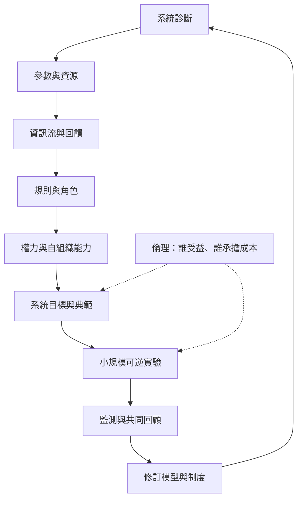

系統介入由淺至深，可能從參數、資訊流與回饋設計開始，也可能涉及規則、自組織能力、權力與目標。介入不能只考慮技術有效性，還須檢視倫理、參與和副作用。

```mermaid
flowchart TD
    A[系統診斷] --> B[參數與資源]
    B --> C[資訊流與回饋]
    C --> D[規則與角色]
    D --> E[權力與自組織能力]
    E --> F[系統目標與典範]
    F --> G[小規模可逆實驗]
    G --> H[監測與共同回顧]
    H --> I[修訂模型與制度]
    I --> A
    J[倫理：誰受益、誰承擔成本] -.-> G
    J -.-> F
```

## 延伸閱讀
* [[深層槓桿點涉及系統目標與世界觀而不僅參數]]
* [[資訊流重設常比追加指標更能改變系統決策]]
* [[系統理論的描述能力不自動提供倫理正當性]]
* [[系統槓桿點]]
* [[自組織]]
* [[系統邊界]]
