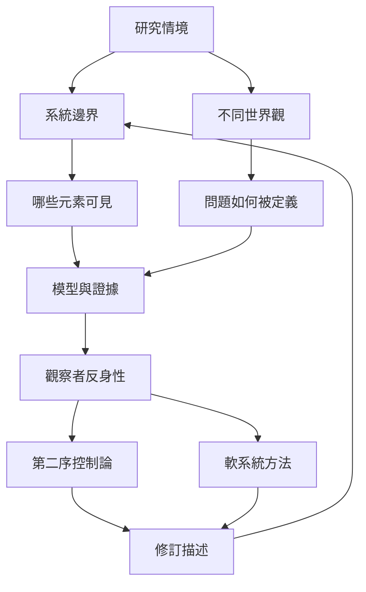

這張地圖處理系統分析如何生產知識。邊界、世界觀與觀察者位置會影響研究問題；軟系統方法透過不同視角的比較促進協商，第二序控制論則把觀察者納入反思。

```mermaid
flowchart TD
    A[研究情境] --> B[系統邊界]
    A --> C[不同世界觀]
    B --> D[哪些元素可見]
    C --> E[問題如何被定義]
    D --> F[模型與證據]
    E --> F
    F --> G[觀察者反身性]
    G --> H[第二序控制論]
    G --> I[軟系統方法]
    H --> J[修訂描述]
    I --> J
    J --> B
```

## 延伸閱讀
* [[先畫系統邊界才能開始分析責任與因果]]
* [[系統觀察者必須把自身納入模型]]
* [[專家模型應作為協商工具而非對現實的替代]]
* [[系統邊界]]
* [[第二序控制論]]
* [[軟系統方法]]
