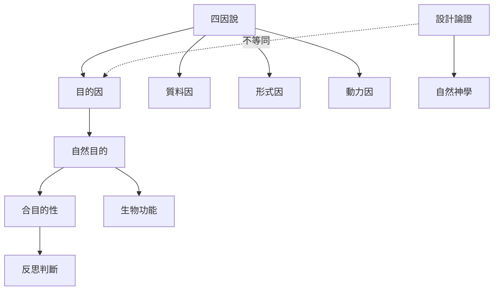

本地圖追蹤從亞里斯多德四因說到康德自然目的的思想脈絡。核心問題是「目的」是否內在於事物生成、作為理解有機體的原則，或只是觀察者運用的反思框架。不要把目的因直接等同外在設計者。

```mermaid
graph TD
  A[四因說] --> B[目的因]
  A --> C[質料因]
  A --> D[形式因]
  A --> E[動力因]
  B --> F[自然目的]
  F --> G[合目的性]
  G --> H[反思判斷]
  F --> I[生物功能]
  J[設計論證] -. 不等同 .-> B
  J --> K[自然神學]
```

相關概念：[[目的論]]、[[目的因]]、[[四因說]]、[[自然目的]]、[[合目的性]]、[[反思判斷]]、[[設計論證]]、[[自然神學]]。
