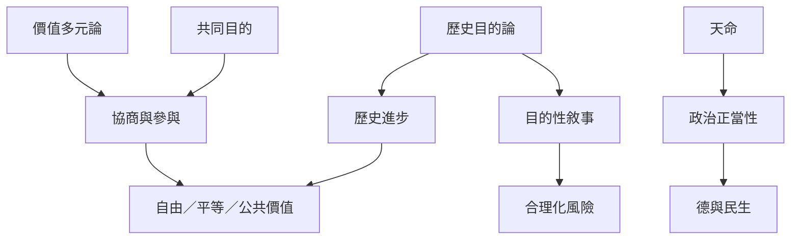

本地圖比較歷史進步敘事、中國天命觀及集體目的的政治功能。它們都可能回答「何種秩序值得追求」，但其歷史脈絡與正當性來源不同。

```mermaid
graph TD
  A[歷史目的論] --> B[歷史進步]
  B --> C[自由／平等／公共價值]
  A --> D[目的性敘事]
  D --> E[合理化風險]
  F[天命] --> G[政治正當性]
  G --> H[德與民生]
  I[共同目的] --> J[協商與參與]
  J --> C
  K[價值多元論] --> J
```

相關概念：[[歷史目的論]]、[[歷史進步]]、[[目的性敘事]]、[[天命]]、[[公共價值]]、[[共同目的]]、[[價值多元論]]。
