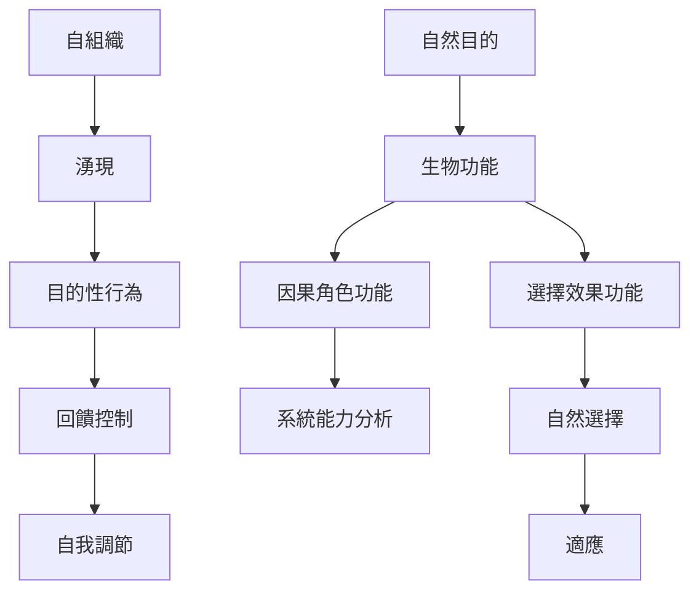

本地圖整理生物學如何保留功能語言，同時以演化、系統分析、控制論與自組織提供自然化解釋。閱讀重點是區分歷史功能與當前因果貢獻。

```mermaid
graph TD
  A[生物功能] --> B[選擇效果功能]
  A --> C[因果角色功能]
  B --> D[自然選擇]
  D --> E[適應]
  C --> F[系統能力分析]
  G[目的性行為] --> H[回饋控制]
  H --> I[自我調節]
  J[自組織] --> K[湧現]
  K --> G
  L[自然目的] --> A
```

相關概念：[[生物功能]]、[[自然選擇]]、[[適應]]、[[選擇效果功能]]、[[因果角色功能]]、[[目的性行為]]、[[回饋控制]]、[[自我調節]]、[[自組織]]、[[湧現]]。
