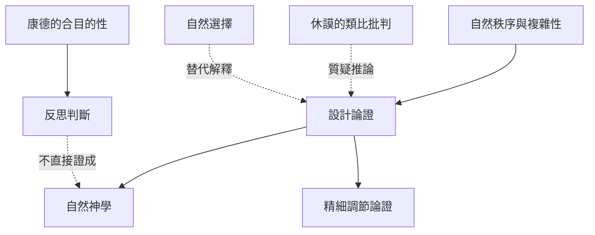

本地圖呈現從自然秩序推論設計者的論證路徑，以及休謨、康德與演化論帶來的不同層次批判。批判自然設計論證，不等於否認自然具有規律、功能或可理解性。

```mermaid
graph TD
  A[自然秩序與複雜性] --> B[設計論證]
  B --> C[自然神學]
  B --> D[精細調節論證]
  E[休謨的類比批判] -. 質疑推論 .-> B
  F[自然選擇] -. 替代解釋 .-> B
  G[康德的合目的性] --> H[反思判斷]
  H -. 不直接證成 .-> C
```

相關概念：[[設計論證]]、[[自然神學]]、[[自然選擇]]、[[合目的性]]、[[目的論]]、[[因果]]。
