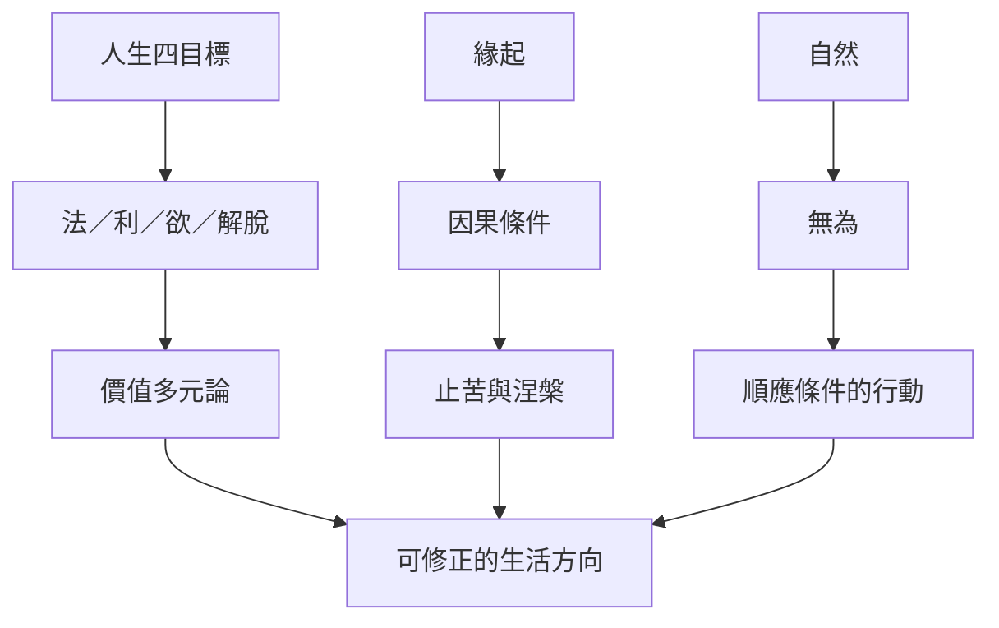

本地圖把印度人生目標、佛教緣起解脫與道家自然無為並列，作為理解生活方向的比較資源。這些傳統並不共享同一套形上學，也不應被壓縮成一種「東方目的論」。

```mermaid
graph TD
  A[人生四目標] --> B[法／利／欲／解脫]
  B --> C[價值多元論]
  D[緣起] --> E[因果條件]
  E --> F[止苦與涅槃]
  G[自然] --> H[無為]
  H --> I[順應條件的行動]
  C --> J[可修正的生活方向]
  F --> J
  I --> J
```

相關概念：[[人生四目標]]、[[價值多元論]]、[[緣起]]、[[因果]]、[[涅槃]]、[[解脫]]、[[自然]]、[[無為]]、[[目的]]。
