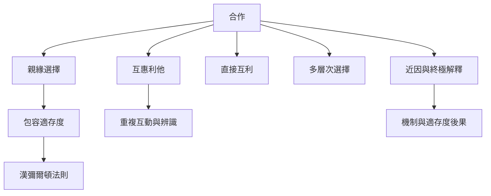

此圖把合作拆成可能機制，而非預設所有助人行為都由同一套演化原因產生。親緣、互惠、互利與群體結構的條件不同，應依案例辨析。

```mermaid
flowchart TD
    A[合作] --> B[親緣選擇]
    A --> C[互惠利他]
    A --> D[直接互利]
    A --> E[多層次選擇]
    B --> F[包容適存度]
    F --> G[漢彌爾頓法則]
    C --> H[重複互動與辨識]
    A --> I[近因與終極解釋]
    I --> J[機制與適存度後果]
```

[[合作]]連到[[親緣選擇]]、[[互惠利他]]與[[多層次選擇]]；[[包容適存度]]與[[漢彌爾頓法則]]提供親緣相關模型；[[近因與終極解釋]]提醒不同層次問題不可混淆。
