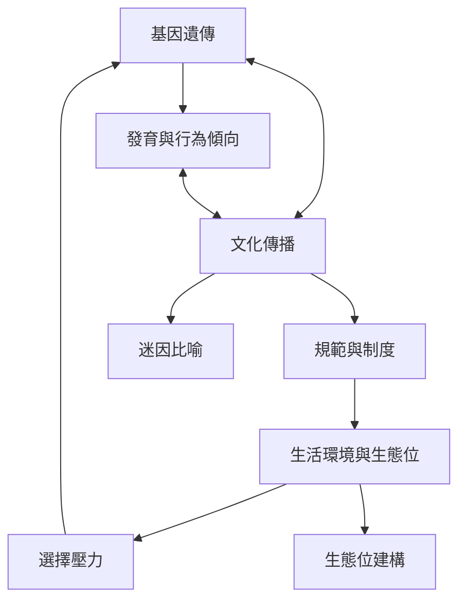

人類文化透過社會學習快速傳播，也會改變飲食、生活環境、制度與互動模式，進而回饋到生物演化。迷因是理解文化複製的一種比喻，基因—文化共演化則是更廣泛的研究框架。

```mermaid
flowchart TD
    A[基因遺傳] <--> B[文化傳播]
    B --> C[規範與制度]
    C --> D[生活環境與生態位]
    D --> E[選擇壓力]
    E --> A
    B --> F[迷因比喻]
    D --> G[生態位建構]
    A --> H[發育與行為傾向]
    H <--> B
```

[[文化與基因共演化]]與[[迷因]]不可等同：前者是研究框架，後者是文化複製的概念比喻。可連讀[[生態位建構]]、[[發展系統論]]與[[基因視角是一種分析尺度而不是生命全貌]]。
