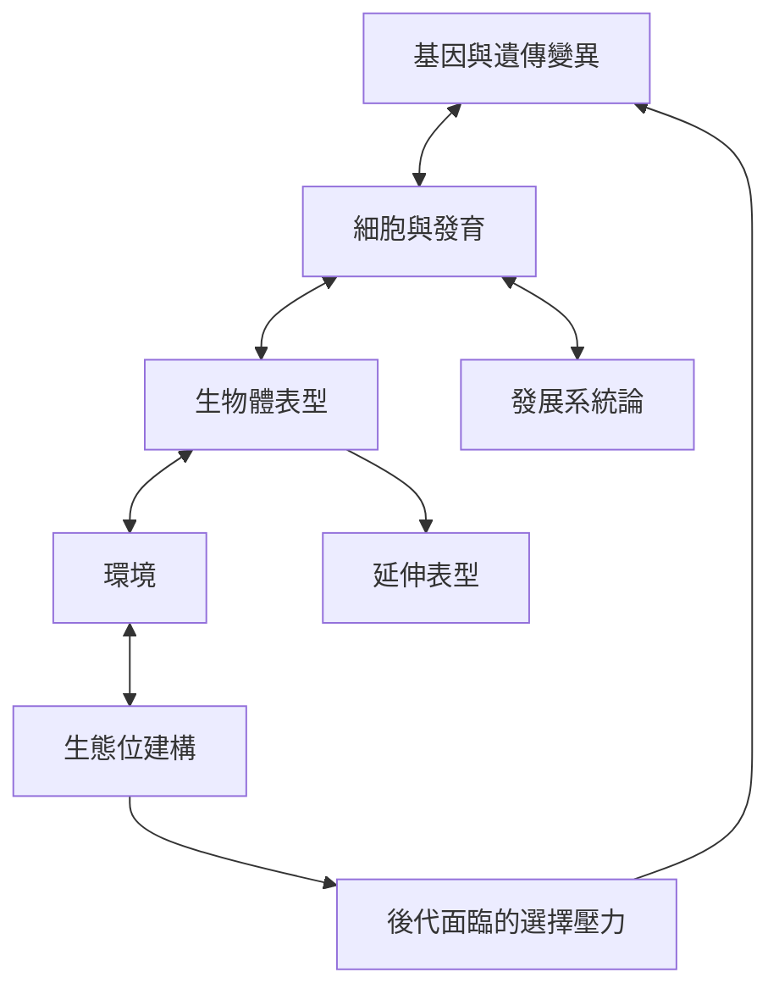

這張地圖呈現基因、身體、環境與發育之間的雙向作用，強調生物體不是只接收基因指令的被動容器。生態位建構則把生物對環境的回饋納入演化過程。

```mermaid
flowchart TD
    A[基因與遺傳變異] <--> B[細胞與發育]
    B <--> C[生物體表型]
    C <--> D[環境]
    D <--> E[生態位建構]
    E --> F[後代面臨的選擇壓力]
    F --> A
    C --> G[延伸表型]
    B <--> H[發展系統論]
```

[[表型]]、[[發展系統論]]、[[生態位建構]]與[[延伸表型]]互相連結；可再參照[[生物體不是基因的被動載具]]與[[生命因果關係由多層次系統共同構成]]。
