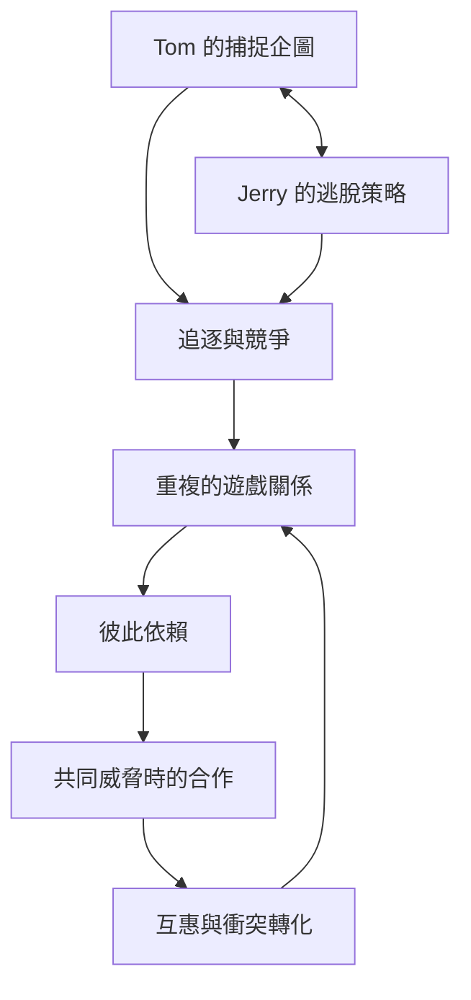

Tom 和 Jerry 的追逐既是衝突，也是兩個角色彼此維持故事與遊戲的方式。這張概念地圖將競爭、互賴、互惠與衝突轉化放在同一張圖上。

相關筆記：[[Tom 與 Jerry 的競爭也可以被讀成持續協商的共生關係]]、[[Tom 與 Jerry 的固定衝突提供了可不斷變奏的敘事引擎]]。

```mermaid
flowchart TD
 A[Tom 的捕捉企圖] <--> B[Jerry 的逃脫策略]
 A --> C[追逐與競爭]
 B --> C
 C --> D[重複的遊戲關係]
 D --> E[彼此依賴]
 E --> F[共同威脅時的合作]
 F --> G[互惠與衝突轉化]
 G --> D
```

## 延伸連結
* [[從角色互賴思考競爭與共同生活的可能]]
