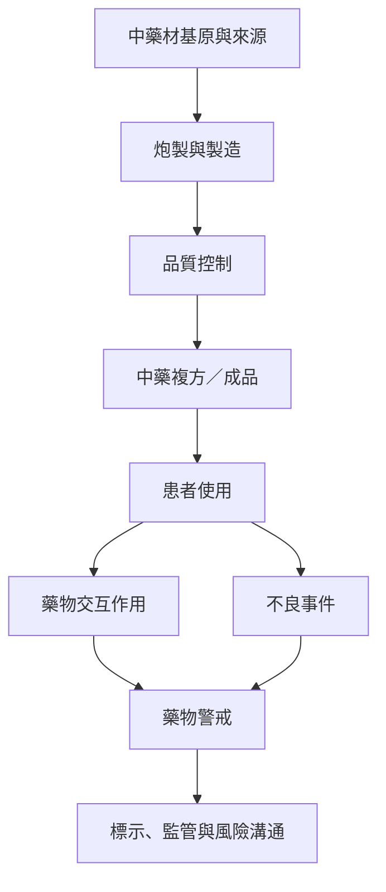

這張地圖呈現中藥從原料到患者使用之間的品質與安全路徑。品質控制、交互作用、藥物警戒與患者資訊彼此相連；任何一環缺失，都可能使風險難以辨識。

```mermaid
flowchart TD
  A[中藥材基原與來源] --> B[炮製與製造]
  B --> C[品質控制]
  C --> D[中藥複方／成品]
  D --> E[患者使用]
  E --> F[藥物交互作用]
  E --> G[不良事件]
  F --> H[藥物警戒]
  G --> H
  H --> I[標示、監管與風險溝通]
```

延伸閱讀：[[藥材品質標準化是複方研究的前置條件]]、[[植物藥安全依賴物種鑑定、污染檢測與交互作用管理]]、[[整合醫療需要共同用藥清單與不良事件通報]]。
