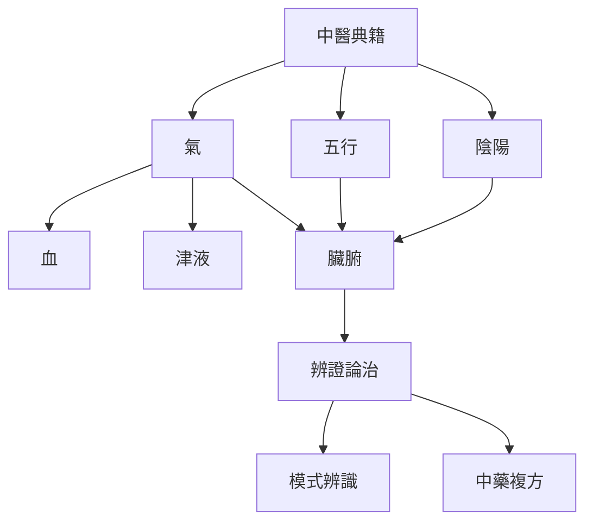

這張地圖整理中醫理論如何由哲學性分類語言，延伸至身體功能模型與臨床辨證。圖中的連線代表傳統知識結構或研究關係，不代表現代生理學已證實所有連線。

```mermaid
flowchart TD
  A[中醫典籍] --> B[陰陽]
  A --> C[五行]
  A --> D[氣]
  D --> E[血]
  D --> F[津液]
  B --> G[臟腑]
  C --> G
  D --> G
  G --> H[辨證論治]
  H --> I[模式辨識]
  H --> J[中藥複方]
```

延伸閱讀：[[中醫不是單一不變的古代體系，而是多層歷史拼接的現代醫學分類]]、[[辨證論治是模式辨識框架，不等於現代病理診斷]]、[[陰陽五行是關係性分類語言，不是解剖學模型]]、[[氣血津液與臟腑是傳統生理概念，不宜與現代器官一對一等同]]。
