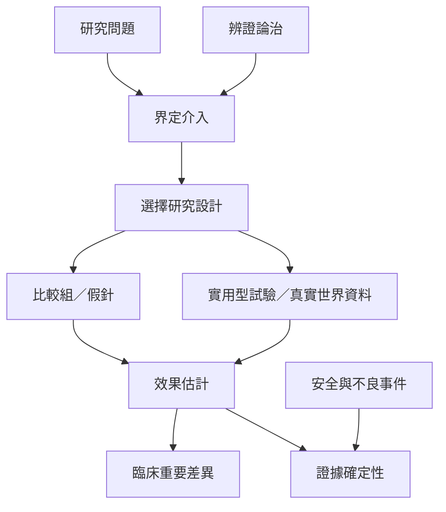

此圖以研究問題為起點，連結介入定義、比較組、結果指標與推論界限。辨證個體化可以被研究，但研究者必須事先說清楚哪些部分固定、哪些部分允許調整。

```mermaid
flowchart TD
  A[研究問題] --> B[界定介入]
  B --> C[選擇研究設計]
  C --> D[比較組／假針]
  C --> E[實用型試驗／真實世界資料]
  D --> F[效果估計]
  E --> F
  F --> G[臨床重要差異]
  F --> H[證據確定性]
  I[辨證論治] --> B
  J[安全與不良事件] --> H
```

延伸閱讀：[[臨床成效需要按介入項目與適應症逐項檢驗]]、[[個體化醫療可以用透明規則與實用型試驗研究]]、[[中醫臨床研究應先說清楚研究的是方劑、辨證流程還是整套照護]]。
