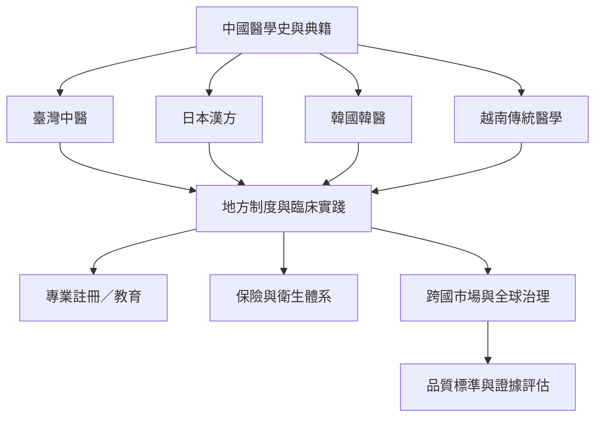

東亞醫學共享部分歷史文本與交流路徑，但不同地區在地方化、國家制度、專業資格、保險與產品監管方面形成不同樣貌。全球化又把這些系統帶入新的市場與跨國治理框架。

```mermaid
flowchart TD
  A[中國醫學史與典籍] --> B[臺灣中醫]
  A --> C[日本漢方]
  A --> D[韓國韓醫]
  A --> E[越南傳統醫學]
  B --> F[地方制度與臨床實踐]
  C --> F
  D --> F
  E --> F
  F --> G[專業註冊／教育]
  F --> H[保險與衛生體系]
  F --> I[跨國市場與全球治理]
  I --> J[品質標準與證據評估]
```

延伸閱讀：[[東亞醫學共享歷史但形成不同的地方制度]]、[[臺灣中醫制度結合健保給付與藥材品質治理]]、[[中醫全球化是一種跨文化轉譯與市場制度化]]、[[傳統醫學整合必須同時檢驗可近性、成效與安全]]。
