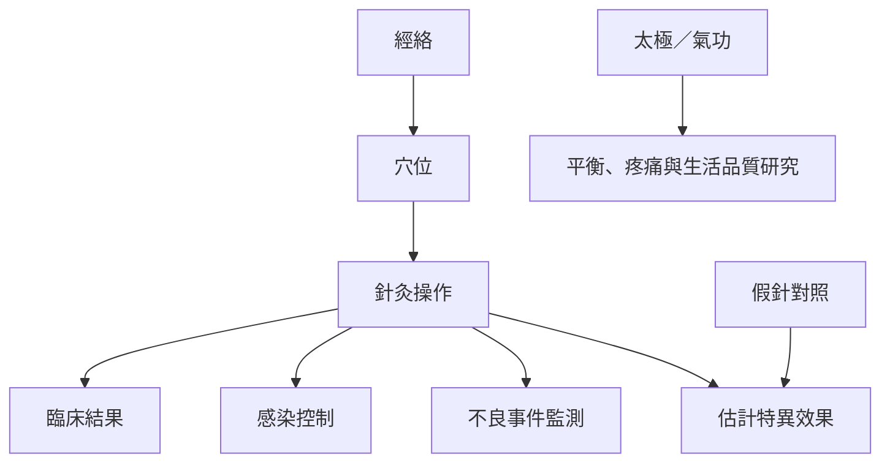

這張地圖將針灸拆成傳統定位、實際刺激、比較設計、臨床結果與安全治理。太極與氣功則屬於身心運動介入，研究問題與針刺不同，不應直接合併為單一效果類別。

```mermaid
flowchart TD
  A[經絡] --> B[穴位]
  B --> C[針灸操作]
  C --> D[臨床結果]
  C --> E[感染控制]
  C --> F[不良事件監測]
  G[假針對照] --> H[估計特異效果]
  C --> H
  I[太極／氣功] --> J[平衡、疼痛與生活品質研究]
```

延伸閱讀：[[經絡穴位應拆分成傳統地圖、刺激操作與生理機制三種命題]]、[[針灸療效會隨對照組設計而改變]]、[[針灸的風險取決於操作技術與感染控制]]、[[安慰劑與治療情境也是臨床照護的一部分]]。
